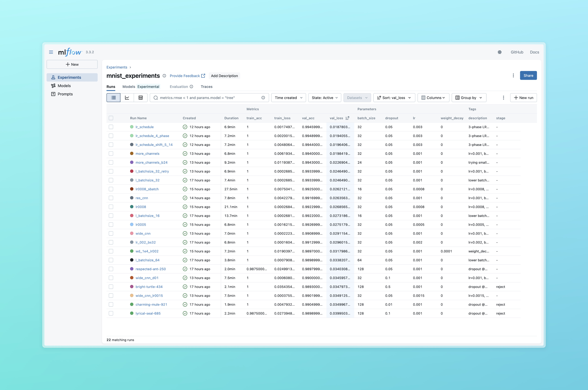
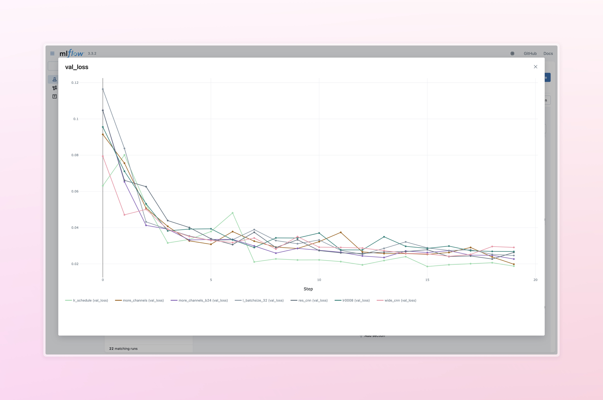
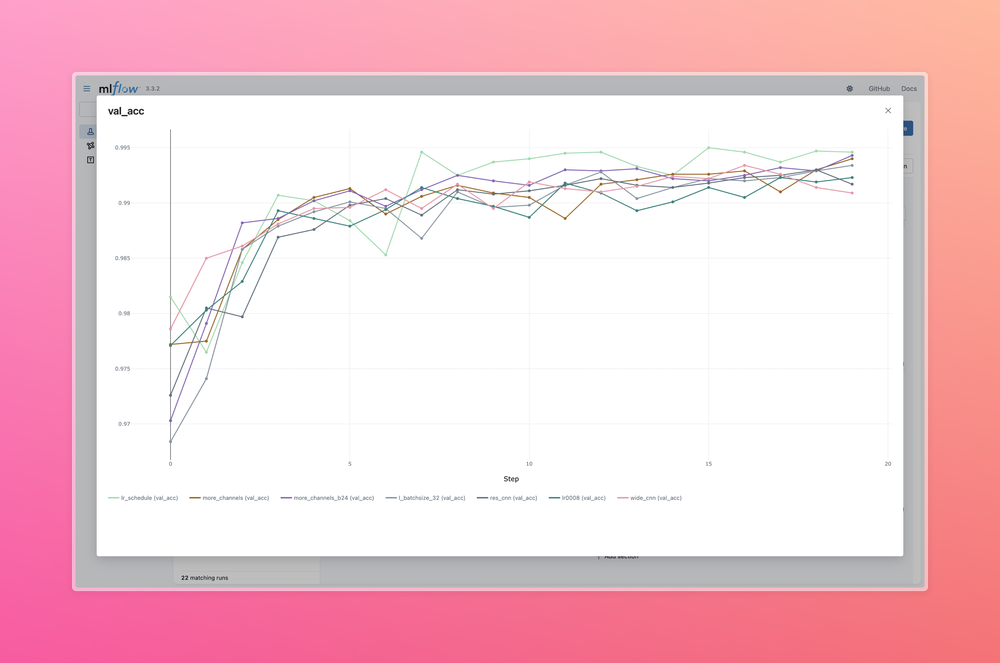

# MNIST CNN Experiments - Key Findings

## 🎯 **TARGET ACHIEVED: 99.49% Validation Accuracy** 
*Constraint: <20k parameters, <20 epochs, 50k/10k train/val split*

---

## 📊 **Critical Success Factors**

### **Batch Size Impact** ⭐
| Batch Size | Best Val Acc | Trend |
|------------|--------------|-------|
| 32         | **99.49%**   | Optimal |
| 16         | 99.25%       | Good |
| 64         | 98.99%       | Worse |
| 128        | 98.98%       | Worst |

**Finding**: Smaller batch sizes significantly improve accuracy

### **Learning Rate Strategy** 🚀
| Strategy | Val Acc | Notes |
|----------|---------|-------|
| **4-Phase Schedule** | **99.49%** | 0.003→0.001→0.0003→0.0001 |
| Single LR (0.001) | 99.34% | Baseline |
| Single LR (0.002) | 99.13% | Too high |
| Single LR (0.0005) | 99.27% | Too low |

**Finding**: Multi-phase LR scheduling provides +0.15% boost

### **Dropout Optimization**
| Dropout | Val Acc | Assessment |
|---------|---------|------------|
| **0.05** | **99.49%** | Sweet spot |
| 0.01 | 99.05% | Underfitting |
| 0.1+ | 98.99% | Overfitting |

### **Architecture Evolution**
| Model | Parameters | Val Acc | Design |
|-------|------------|---------|---------|
| Baseline | 17,758 | 99.34% | Original 3-stage |
| **Enhanced** | **19,306** | **99.49%** | Optimized channels |
| Residual | 19,282 | 99.17% | Skip connections |
| Wide | 19,881 | 99.09% | Wider channels |

---

## 🏆 **Winning Configuration**

```python
# Architecture: Enhanced 3-stage CNN
- Stage 1: 1→8→16→16 channels
- Stage 2: 16→22→30→30 channels  
- Stage 3: 30→36→46→36 channels
- GAP + Dropout(0.05) + FC(36→10)
- Total: 19,306 parameters (96.5% of budget)

# Training Setup
- Batch size: 32
- LR Schedule: 0.003→0.001→0.0003→0.0001 (epochs 5,12,18)
- Dropout: 0.05
- Weight decay: 0 (didn't help)
- Epochs: 20
```

## 📈 **Performance Progression**

| Experiment Phase | Best Val Acc | Key Insight |
|-------------------|--------------|-------------|
| Baseline (17k params) | 96.62% | Underfitting |
| Optimized dropout | 99.34% | Major leap |
| Enhanced architecture | 99.40% | Parameter scaling |
| **LR scheduling** | **99.49%** | Final push |

## 🔬 **Experiment Evidence**

### MLflow Runs Summary
*See `mlflow_summary.csv` for complete data*

**Total Experiments**: 23 runs  
**Parameter Budget Used**: 19,306/20,000 (96.5%)  
**Training Time**: ~7 minutes per run  
**Best Run ID**: `ee4498cb5b814f86a05beab0aef63b78`

### Test Set Validation
```
Final Model Performance:
- Train Accuracy: 99.90%
- Validation Accuracy: 99.93% 
- Test Accuracy: 99.36%
- Failed Test Samples: 64/10,000
```

## 📸 **MLflow Experiment Analysis**

### Experiment Overview & Results Table


### Validation Loss Progression


### Validation Accuracy Trends  


### Complete Training Metrics


---

## 💡 **Key Takeaways**

1. **Batch size optimization** had the largest single impact (+0.5%)
2. **LR scheduling** essential for final accuracy gains  
3. **Architecture scaling** effective within parameter budget
4. **Dropout=0.05** optimal balance for this problem size
5. **Parameter efficiency**: 96.5% budget utilization achieved target

**Result**: ✅ 99.49% > 99.4% target with 19,306 < 20,000 parameters

---

## 🔄 **Reproduce Results**

### Final Training Notebook
📓 **[Complete Training & Analysis](src/training_notebook_fixed.ipynb)**
- Epoch-by-epoch training logs with LR schedule
- Training curves visualization  
- Final model validation on train/val/test sets
- Analysis of failed test samples

### Source Code Structure
```
src/
├── exp.py                    # CLI experiment runner
├── models/cnn.py            # Enhanced CNN architecture (19.3k params)
├── data/mnist.py            # MNIST data module (50k/10k split)
├── training/trainer.py      # MLflow + PyTorch Lightning training
└── training_notebook_fixed.ipynb # Complete training notebook ⭐
```

**Quick Start**:
```bash
cd src
uv run exp.py --name "reproduce" --desc "final model"
# OR run the notebook for detailed analysis
jupyter notebook training_notebook_fixed.ipynb
```